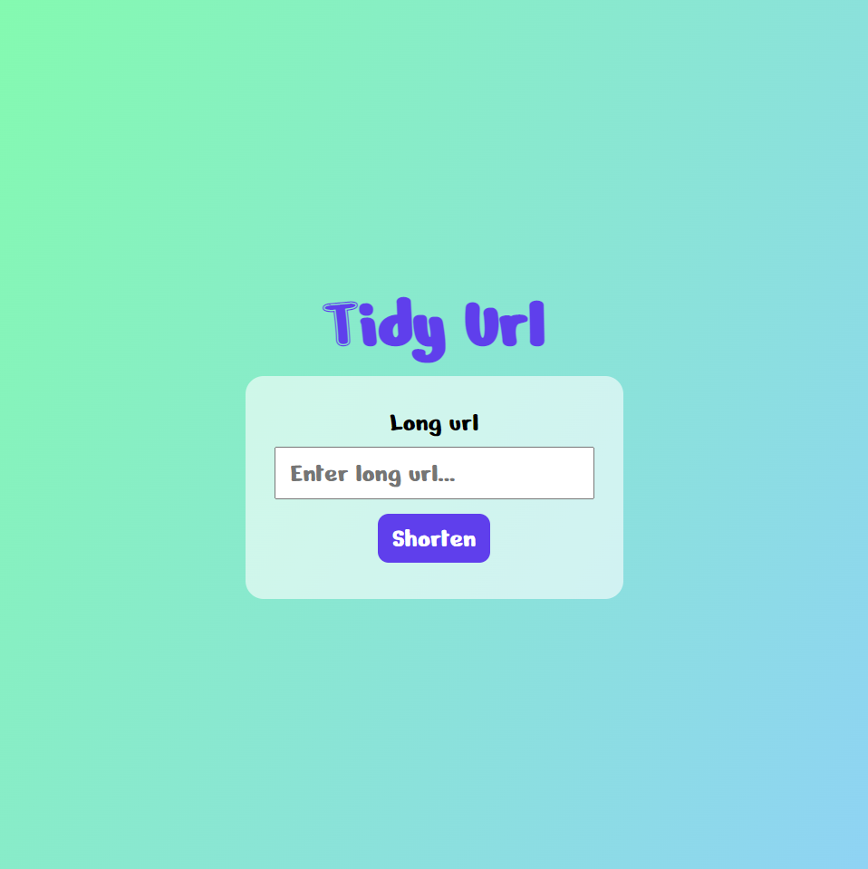
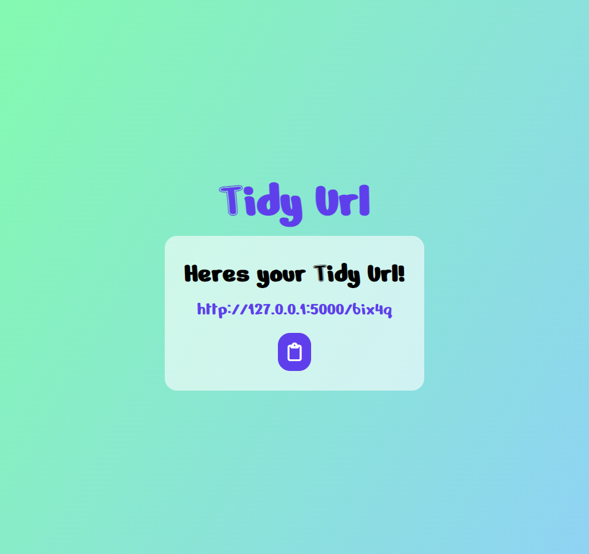

# Tidy Url

Welcome to Tidy Url!
shorten Your long urls to small tidy urls with our app!

## Installation & Usage

### Installation

- Clone or download the repo.

## Frontend

- Open terminal & CD into the repo/backend
- npm install

## Backend

- Open terminal & CD into the repo/backend
- Run `pipenv shell` to start the docker container
- Run `pipenv install` to install all dependencies
- Run `pipenv install --dev` to install dev dependencies

### Usage

- Cd into the backend folder folder
- Run `npm run start`
- Open another shell Cd into the backend folder
- Run `pipenv shell`

## Technologies

- Python
- React
- JavaScript
- CSS
- HTML
- Flask
- Axios

## Screenshots/Images/Gifs

## Wins & Challenges

### Wins

- Learned flask
- Learned to redirect users from one link to another

### Challenges

- Python
- Flask

## Future Features

- Login & sign up
- Stats for urls
